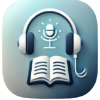
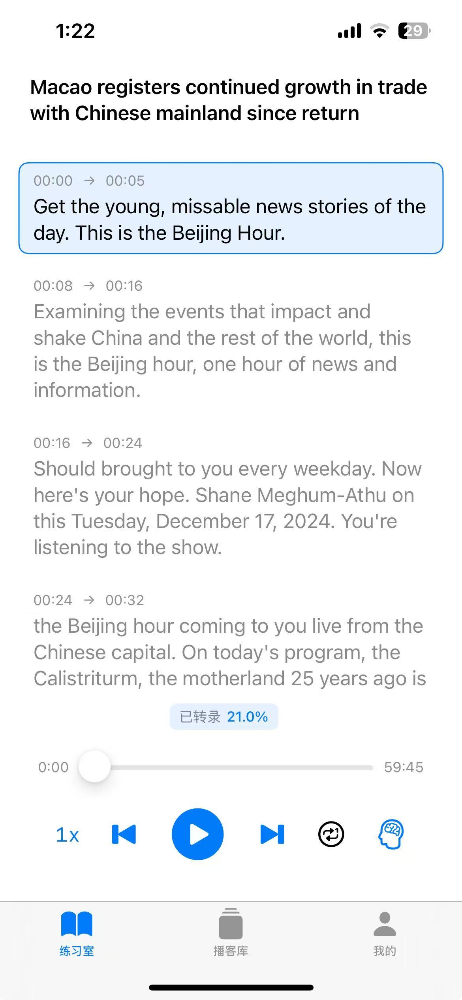
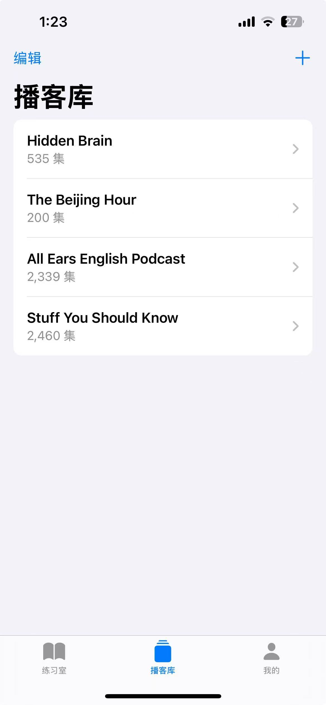
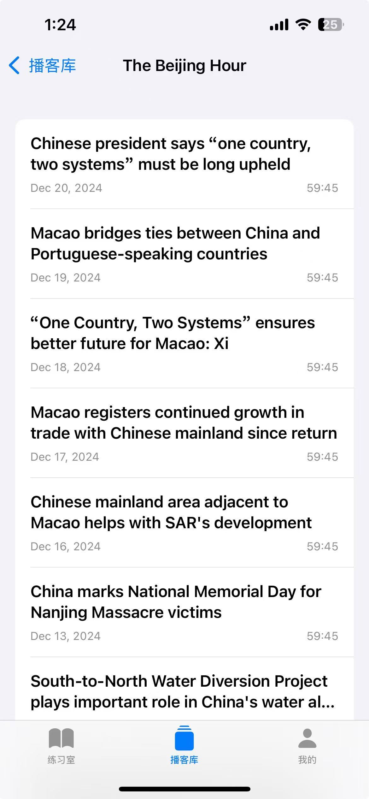

# PodKnows

一款专为提升英语听力设计的应用。用户可以通过添加播客的RSS地址，边播放边在iPhone本地解析音频字幕，并展示出来

## 主要功能

1. 添加播客RSS地址
用户可以轻松添加自己喜欢的播客RSS地址，应用会自动获取并播放最新的播客内容。

2. 本地解析音频字幕
应用在播放音频的同时，会在iPhone本地解析音频字幕，并同步展示，帮助用户更好地理解内容。

1. 循环听写功能
用户可以选择特定的句子或段落进行循环播放和听写练习，反复听写有助于提高听力和记忆。

1. 种播放模式
应用提供多种播放模式，包括正常播放、慢速播放和重复播放，满足不同学习需求。
 

## 产品截图

  
  
  
  

## 开始使用

### 系统要求
- iOS 15.0 或更高版本
- iPhone 或 iPad 设备

### 安装方式

1. 当前仅支持源码自行编译

